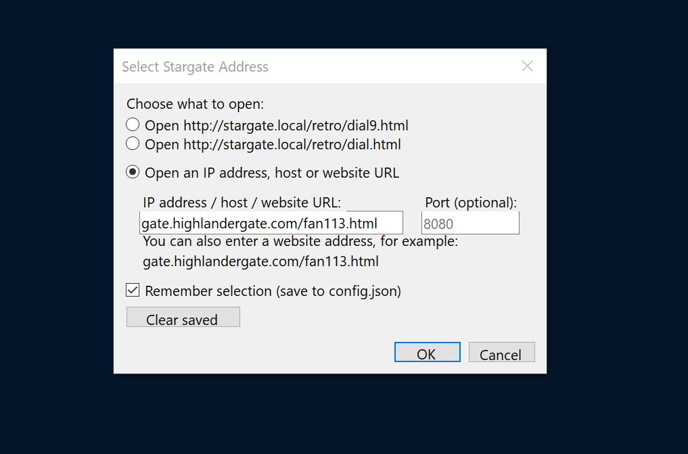
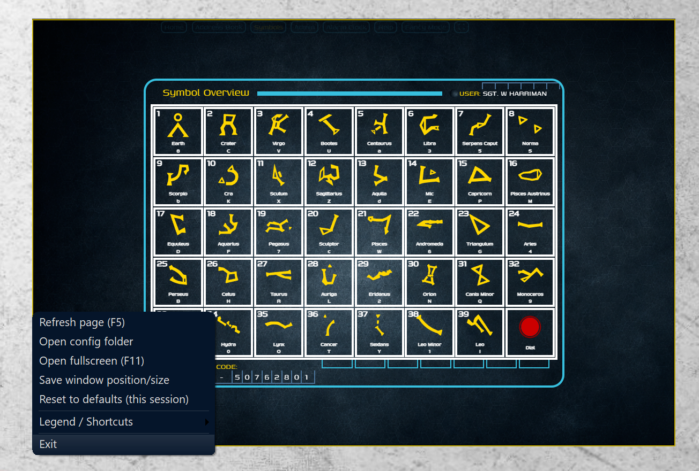
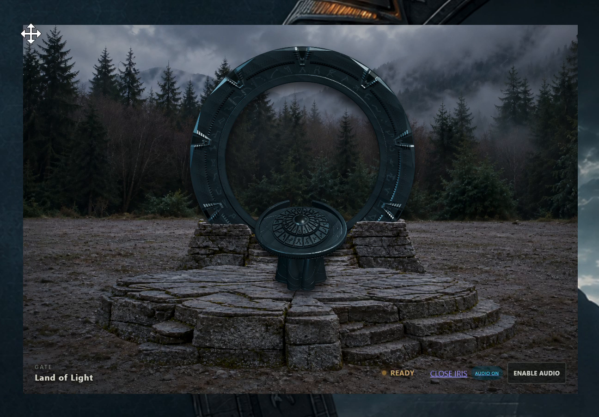
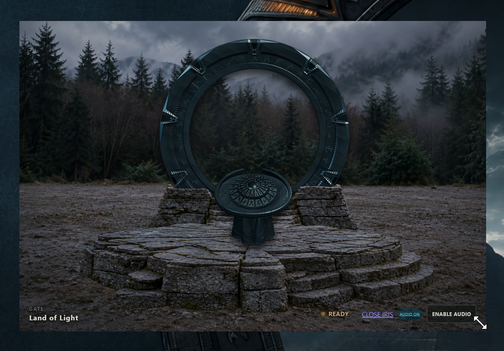

# StarGateWebView

A Windows desktop viewer for Stargate web interfaces, built with C# WinForms and Microsoft WebView2 Evergreen.

[Download the latest Windows x64 installer](https://github.com/matelv-x/StarGateWebView/releases/latest)

## Features

- Frameless desktop window, dragging and resizing from the corners.
- F11 fullscreen toggle and F5 page refresh.
- Saved connection profiles and window position/size.
- WebView2 Evergreen: the browser engine is maintained separately by Microsoft.
- Single EXE installer with extraction progress, automatic detection/installation of missing Evergreen, desktop shortcut and optional startup at Windows login.
- Updating an existing installation preserves settings and removes the previous application files after a successful replacement.
- Uninstall entry in Windows Settings, including the application icon.

## Window controls

- **Top-left corner:** hold the left mouse button and drag to move the window around the desktop.
- **Bottom-right corner:** hold the left mouse button and drag to resize the window.
- **Bottom-left corner:** click to open the application menu.
- **F11:** toggle fullscreen. **F5:** refresh the page.

## Installation and updates

1. Download `StarGateSetup-x64.exe` from Releases.
2. Run it and choose your installation name, shortcuts and destination folder.
3. Open the application and choose your Stargate server or web address.

The installer includes .NET 8. If WebView2 Evergreen is missing, the Microsoft bootstrapper installs it; internet access is required for this step. When Evergreen is already present, this installation step is skipped. Application updates are installed by downloading and running the newer installer; this application does not automatically download new application releases.

This release is Windows x64. Native ARM64 binaries are not included in this release.

## Screenshots

Screenshots supplied by the author.





| Move window | Resize window |
| --- | --- |
|  |  |

The displayed web interface belongs to the connected Stargate server and is not included in this application.

## Uninstall and stored data

Close the application, then open Windows Settings → Apps → Installed apps → your chosen installation name → Uninstall. Alternatively, run `Uninstall.ps1` from the installation folder with PowerShell.

Uninstall removes the application, its shortcuts and installation configuration pointers. It retains browser profiles/settings stored under `%LOCALAPPDATA%\StarGateWebView` and keeps the shared WebView2 Evergreen runtime. Delete the profile folder yourself only if you want to reset your saved browser data and settings.

## Build from source

Requires Windows, PowerShell and the .NET 8 SDK (or a newer SDK capable of building .NET 8 applications).

```powershell
powershell -NoProfile -ExecutionPolicy Bypass -File .\launcher\Build-Package.ps1
```

Output: `launcher/bin/setup-win-x64/StarGateSetup.exe`. The script downloads the official Microsoft Evergreen bootstrapper if needed and verifies its Authenticode signature. It builds in a temporary directory and cleans up that directory after packaging. Compiled installers belong in Releases, not in Git history.

To run the application from Visual Studio, open `app/StarGateWebView.csproj` and use it as the startup project. For a command-line build:

```powershell
dotnet build app/StarGateWebView.csproj -c Release
```

## License

See [LICENSE](LICENSE) for the existing personal/educational, non-commercial use and redistribution terms. Stargate names and the displayed server artwork belong to their respective owners.
